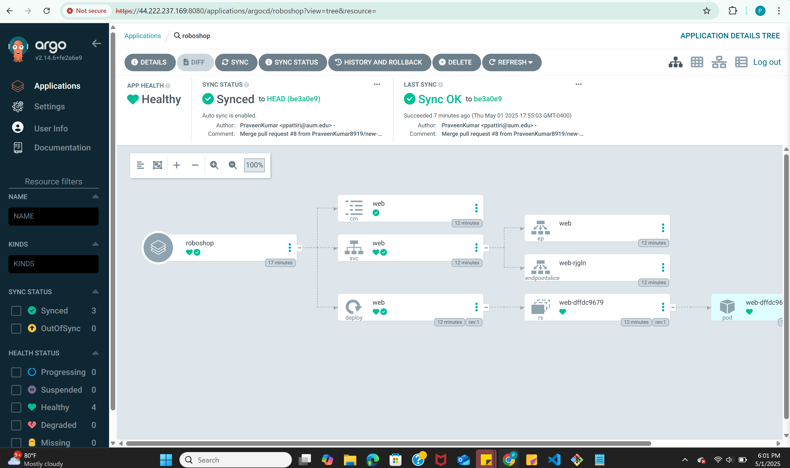

# Adding ArgoCD to Your Kubernetes Cluster

Follow the steps below to install and set up ArgoCD in your Kubernetes cluster:

## Step 1: Create the ArgoCD Namespace
Run the following command to create a namespace for ArgoCD:
```bash
kubectl create namespace argocd
```

## Step 2: Install ArgoCD
Apply the ArgoCD installation manifest in the `argocd` namespace:
```bash
kubectl apply -n argocd -f https://raw.githubusercontent.com/argoproj/argo-cd/stable/manifests/install.yaml
```

## Step 3: Access the ArgoCD Server
Use port-forwarding to access the ArgoCD server:
```bash
kubectl port-forward svc/argocd-server -n argocd 8080:443
```

You can now access the ArgoCD UI at `https://localhost:8080`.

Alternatively, to allow external access, use the following command:
```bash
kubectl port-forward svc/argocd-server -n argocd 8080:443 --address 0.0.0.0
```

You can now access the ArgoCD UI at `ec2-instance:8080`.

To fetch the admin password:
```bash
kubectl get secrets -n argocd
```

Edit the initial admin secret and decrypt the base64 value to retrieve the password.
```bash
kubectl edit secret argocd-initial-admin-secret -n argocd
```

Look for the `password` field, copy the base64-encoded value, and decode it:
```bash
echo "<base64-password>" | base64 --decode
```
Replace `<base64-password>` with the copied value.
## ArgoCD UI Screenshot
Below is an example of the ArgoCD UI:

